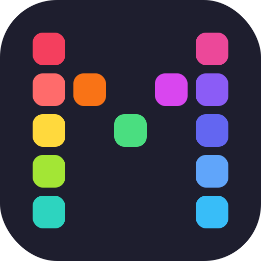

<p align="center">
  
</p>

<h1 align="center">Mosaic API</h1>

<p align="center">
  <strong>Open-source, secure, and ethical backend for plural system management.</strong><br>
  Open Source alternative to SimplyPlural.
</p>

<p align="center">
  
  
  
  
</p>

---

> [!NOTE]  
> This repository contains the **Core API** (Backend). If you are looking for the mobile application, please check the [ourmosaic/app](https://github.com/ourmosaic/app) repository (Kotlin/Jetpack Compose).

## About Mosaic

**Mosaic** is an application designed to help plural systems (DID, OSDD, etc.) organize their daily lives. Unlike proprietary solutions, OurMosaic places **privacy** and **data sovereignty** at the heart of its architecture.

### MVP Features (In Progress)

- [X] **Member Management**: Create detailed profiles for each alter (name, pronouns, avatar, role).
- [X] **Group Organization**: Classify your members into custom folders/groups.
- [ ] **Front Tracking**: Log who is in control in real-time with a precise visual history.
- [X] **Custom Fields**: Tailor the app to your needs with dynamic fields (colors, dates, text).
- [X] **Simply Plural Import**: Easily migrate your existing data.
- [X] **Privacy by Design**: Granular control over what you share with friends.

### Real-time Notifications (SSE)

- `GET /v1/notifications` -> global multiplexed stream for friendship + imports + federated front sessions (+ local front sessions when a system exists)
- `GET /v1/notifications/user` -> user-only stream for friend requests/updates + imports
- `GET /v1/notifications/system` -> system-only stream for local front session updates
- `GET /v1/notifications/stream` -> legacy alias for the global stream
- `GET /v1/notifications/friendship` -> friend requests/updates for the authenticated user
- `GET /v1/notifications/front-sessions` -> front session updates for the authenticated system
- `GET /v1/notifications/federation/front-sessions` -> federated front updates relayed from remote instances

All endpoints use Server-Sent Events and require the same Bearer authentication as the REST API.

Each SSE stream sends:

- `ready` when the Redis subscription is established
- `notification` for business events
- `keepalive` immediately on connection, then every ~5 seconds while idle

Example payload on `/v1/notifications`:

```json
{
  "topic": "front-sessions",
  "payload": {
    "event": "FRONT_SESSION_STARTED",
    "data": {
      "sessionId": "...",
      "memberId": "..."
    }
  }
}
```

Example keepalive event:

```json
{
  "scope": "notifications:global",
  "timestamp": "2026-05-10T12:34:56.789Z"
}
```

---

## Technical Stack

- **Framework**: NestJS (Node.js)
- **Database**: PostgreSQL 15+
- **ORM**: Prisma 7 (Modern JS adapter engine)
- **Cache / Real-time**: Redis (via ioredis)
- **Auth**: JWT + Refresh Tokens stored in Redis, Argon2 hashing.

---

## Installation (Development)

### Prerequisites
- Node.js (v18+)
- Yarn or NPM
- Docker & Docker Compose

### Quick Start

1. **Clone the project**:
   ```bash
   git clone https://github.com/ourmosaic/api.git mosaic-api
   cd mosaic-api
   ```

2. **Start the infrastructure**:
```bash
docker-compose up -d
```

3. **Configure environment**:
Copy `example.env` to `.env` and adjust your variables. Please also adjust the variables in `src/utils/constants.ts`

4. **Initialize database**:
```bash
yarn install
yarn prisma generate
yarn prisma migrate dev
```

5. **Run the server**:
```bash
yarn start:dev
```

---

## Contributing

All contributions are welcome: code, design, translation, or user feedback.

> **Mosaic** aims to become a non-profit association to ensure its long-term independence and transparency.

---

## License

This project is licensed under the [Polyform Noncommercial License 1.0.0](https://polyformproject.org/licenses/noncommercial/1.0.0/). You are free to use, modify, and self-host it.